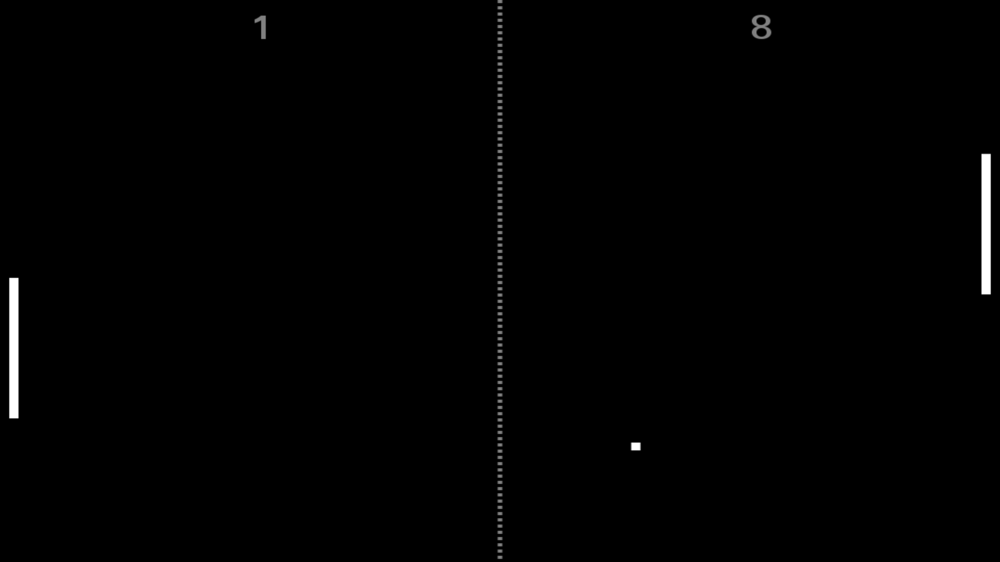

# pong.js
A full JavaScript/HTML5 pong game playable with the mouse, a keyboard or multitouch screens.

[Example](http://thibaut.guirimand.perso.sfr.fr/#pong-article)



## How to insert it in your website

In you html file insert this canvas tag :

```html
<canvas id="pong" width="1080px" height="720px"></canvas>
```

You can change the width and height to enlarge the canvas resolution.

The canvas can be adapted to your webpage using CSS properties.

Call *pong.js* from your html file and insert this lines in your JavaScript page
to start the game :

```javascript
var p = new Pong(true, false);
p.start();
```

The arguments of Pong(arg1, arg2) :
* arg1 : true to play versus an IA and false two players
* arg2 : true to reduce the winning player's bar false to keep both bars the same size


## How to use it

Typing enter permit to enable the full screen mode.

The left player can move using the z and s key or the mouse. The right player can use the up and down keys.

The game can also be played using multi touch screens.
